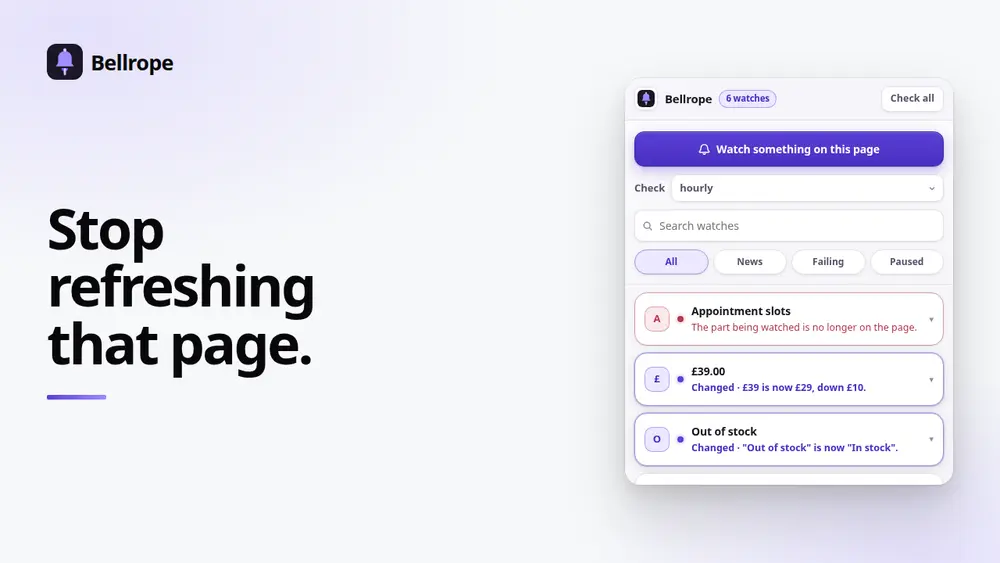
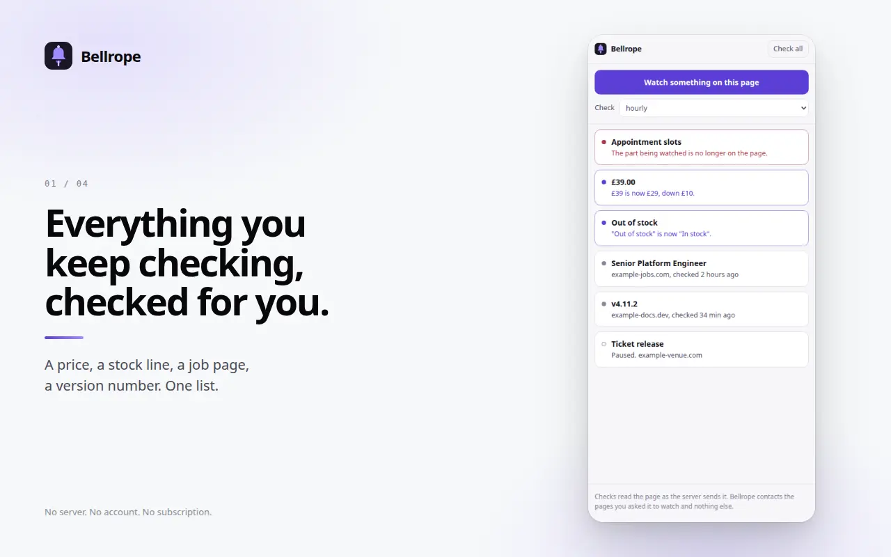
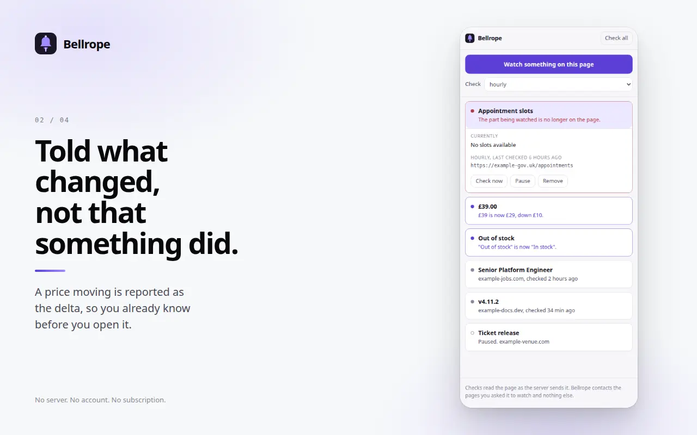
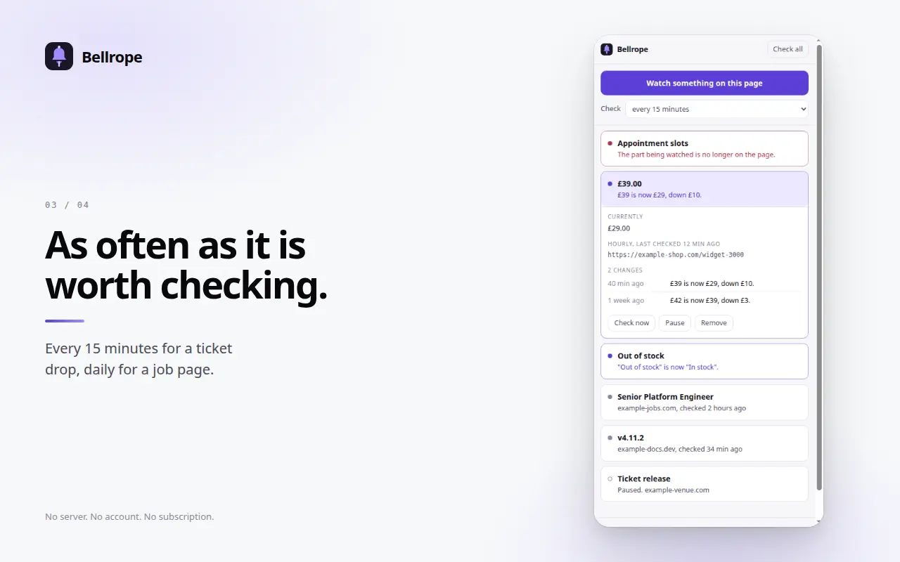
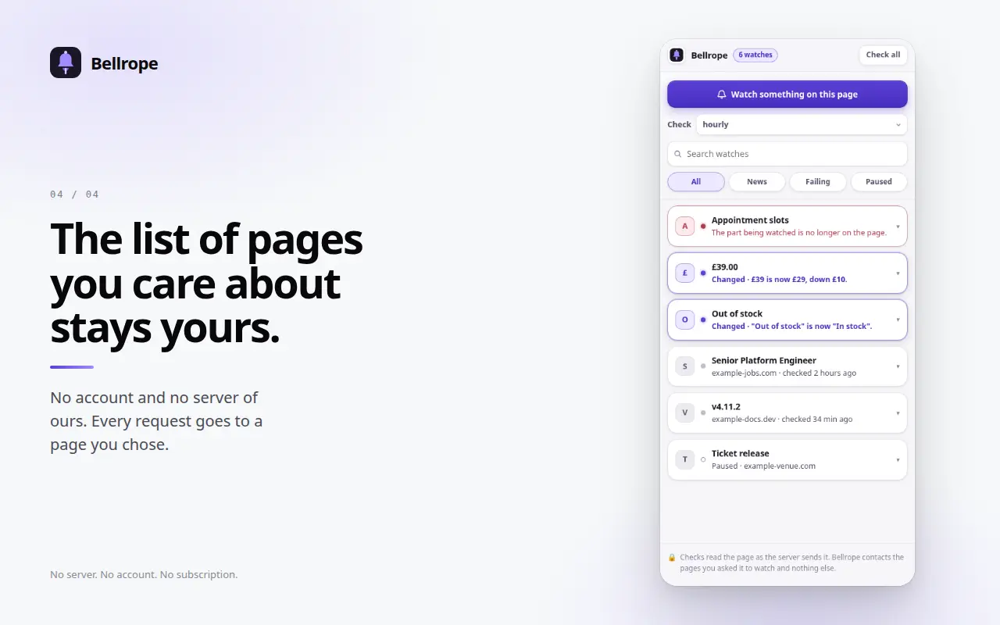

# Bellrope

Watch one part of a page and get told when it changes. The price, the stock
line, the version number, the thing you keep opening a tab to check. Checks run
in your browser, on a schedule you set, and the only server involved is the one
you are watching.

[](https://github.com/royalpinto007/Bellrope/actions/workflows/ci.yml)
[](LICENSE)
[](manifest.json)
[](#how-it-works)

<!-- media:start -->

<p align="center">
  
</p>

<h3 align="center">Stop refreshing that page.</h3>

<p align="center">
  <a href="docs/media/demo.mp4">
    
  </a>
  <br>
  <a href="docs/media/demo.mp4"><b>Watch the 30 second demo</b></a>
</p>

## Screenshots



<sub>Everything you keep checking, checked for you.</sub>

<details>
<summary><b>See 3 more</b></summary>

### What changed



<sub>Told what changed, not that something did.</sub>

### Schedule



<sub>As often as it is worth checking.</sub>

### Local



<sub>The list of pages you care about stays yours.</sub>

</details>

<sub>Every screenshot is captured from the real extension running in Chrome, not
mocked up, so they cannot drift from what the product actually does. Regenerate
them with the tooling in the store-publishing workspace.</sub>

<!-- media:end -->

## Why

Every tool that does this runs on someone else's servers and charges monthly
for it. That means handing over the list of pages you care about, which for
most people is a fairly personal document: what you are buying, which job
listing you are refreshing, which appointment page you are waiting on.

None of that needs a server. A browser can fetch a page and compare it to what
it saw last time. Bellrope does exactly that and nothing else.

## What it does

1. Open a page and press **Watch something on this page**.
2. Click the bit you care about. Bellrope outlines whatever is under your
   cursor, and the click never reaches the page, so picking a "Buy now" button
   does not buy the thing.
3. Choose how often to check: every 15 minutes, hourly, every 6 hours, daily.

When it changes you get a notification saying **what** changed:

> £39 is now £29, down £10.

Not "the page changed", which sends you to the page to find out what, which is
the work you installed this to avoid.

## What it will not do

Checks read the page as the server sends it. A page that builds itself in your
browser sends a near-empty shell, and the thing you clicked is not in it.

Bellrope tells you this **at the moment you set the watch up** and refuses to
create it. A watch that could only ever report "nothing found" is worse than a
refusal, because you would believe it was working and stop checking yourself.

It also signs in to nothing. Requests are made without cookies, so a watch
reads the page as a stranger sees it. That is deliberate: the alternative is
keeping your signed-in account pages in extension storage.

## Install

Not on the Chrome Web Store yet. To run it now:

```bash
git clone https://github.com/royalpinto007/Bellrope.git
cd Bellrope
npm ci
npm run build
```

Open `chrome://extensions`, enable Developer mode, choose Load unpacked and
select the repository root.

## Privacy

Bellrope has no server. There is no account, no sync, no analytics and no
telemetry, and CI fails the build if a hardcoded URL of any kind appears in the
shipped code. Every request it makes goes to a page you chose.

Your watches, and the text they last saw, live in local extension storage on
your machine.

It also holds no standing access to any page: there are no content scripts and
no `host_permissions` in the manifest. Page access is asked for when you create
your first watch. CI fails the build if a standing permission appears.

## How it works

```
sidepanel.ts ──▶ background.ts ──alarm every 5 min──▶ whatever is due
                      │
                      ├── fetch(url)  ──▶ src/encoding.ts   decode as a browser would
                      ├── offscreen.ts ──▶ src/extract.ts   parse and read the element
                      └── src/watch.ts ──▶ src/diff.ts      what changed, in words
```

The service worker has no `DOMParser`, so fetched HTML is parsed in an offscreen
document. That document runs no page script and loads no subresource, which is
the reason to parse there rather than open the page in a tab.

Everything that can be pure is pure and lives in `src/`, because the interesting
cases here are all about time and are miserable to reproduce against a live site:

- **`selector.ts`** finds the same element again in a page the site has rebuilt
  since. It ignores framework-generated ids (`:r3:`, `Button_root__x8f2k`,
  `css-1q2w3e`) and utility classes, because those look like the most stable
  thing on the page and change on every deploy.
- **`diff.ts`** turns two strings into a sentence. It recognises a single number
  moving and reports the delta; two numbers moving at once is not something one
  line can honestly describe, so it falls back rather than guessing.
- **`schedule.ts`** decides what is due, and backs off by doubling after each
  failure. A site down for an hour costs nothing; a site that has been 404 since
  Tuesday gets asked once a day rather than ninety-six times.
- **`watch.ts`** folds a check result into a watch. Every path returns a watch,
  so a failure can never lose one, and a failed check keeps the last known text.
- **`encoding.ts`** decodes a fetched page the way a browser would, including the
  charset declared only in a `<meta>` tag. Getting this wrong is quiet and
  permanent: the text decodes to the same mojibake every time, so nothing ever
  looks like a change and the watch simply never fires.

## Development

```bash
npm run typecheck
npm test            # 68 tests: diffing, scheduling, selectors, encoding, state
npm run build
npm run test:e2e    # the built extension in real Chrome; needs Playwright
```

The end-to-end run serves a page whose price it controls, creates a real watch
through the real service worker, changes the price, and checks that the right
sentence comes out the other end. It also covers the picker running inside a
page, the offscreen parser, the notification, and what happens when the site
goes away.

Contributions are welcome: see [CONTRIBUTING.md](CONTRIBUTING.md).

## Licence

MIT. See [LICENSE](LICENSE).
